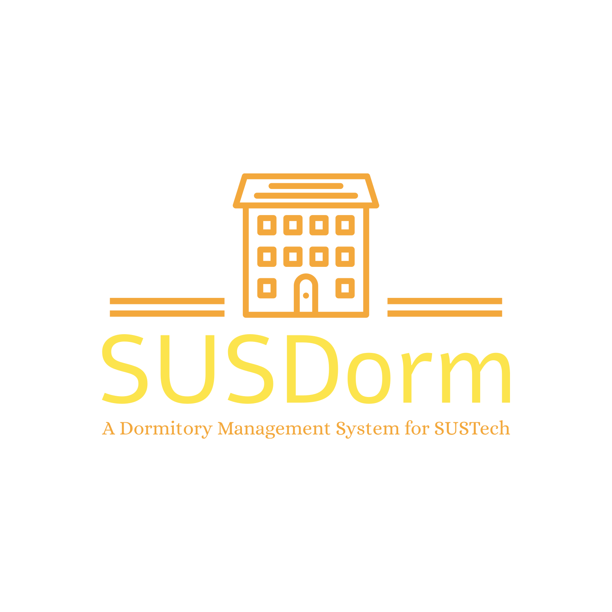

<div align=center>




# SUSDorm

**A Dormitory Management System for SUSTech**

**It's also the project of SUSTech OOAD course.**

</div>

## Features

### Frontend
The front end uses Vue.js and Nuxt.js, we leverage Vue.js for its easy-to-understand component-based programming, Nuxt.js front-end features such as automatic routing, server-side rendering/caching for fast rendering, and deployed on Vercel.

Key features from the front end include:
- Selecting rooms in different locations on campus with different room types.
- Commenting and rating rooms.
- Group chats for room discussion.
- Faculty Portal to support administrative functions such as performing CRUD in objects in websites.

### Backend


## Quickstart

### Frontend


### Backend

```bash
cd frontend
```
Enter the backend directory.

```bash
pip install -r requirements.txt
```
Set up the environment first.

Please change uWSGI.ini and susdormAdmin/settings.py according to your environment.

```bash
uwsgi uwsgi.ini
```
Use uwsgi to run the application.

## Contributors

<a href="https://github.com/XavierYuhanLiu/OOAD-Project-SUSDorm/graphs/contributors">
  
</a>

## License

[MIT](LICENSE)
